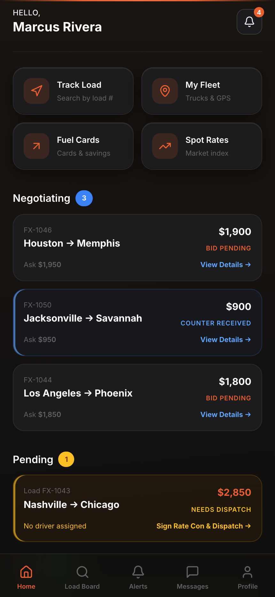
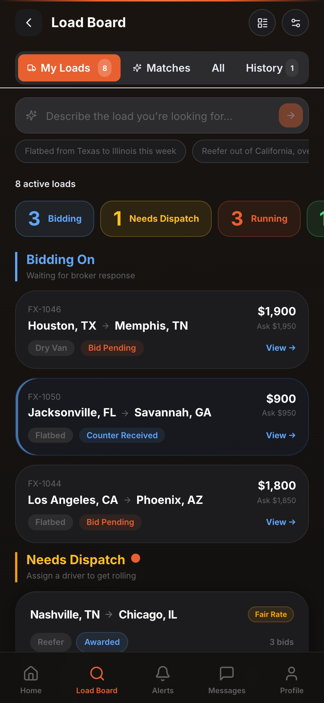
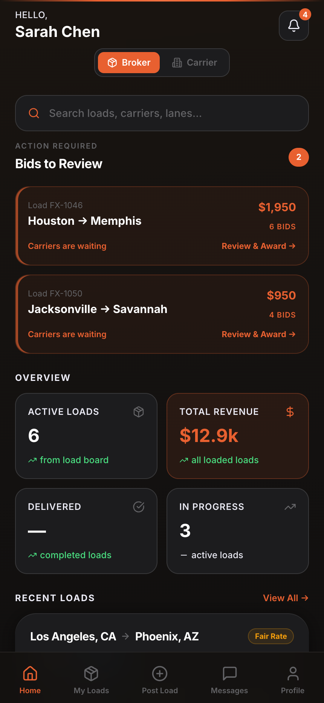
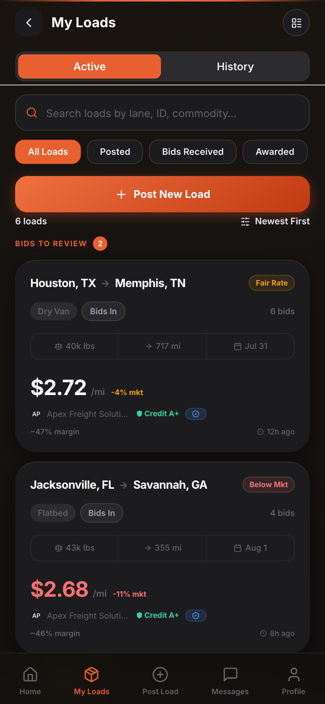
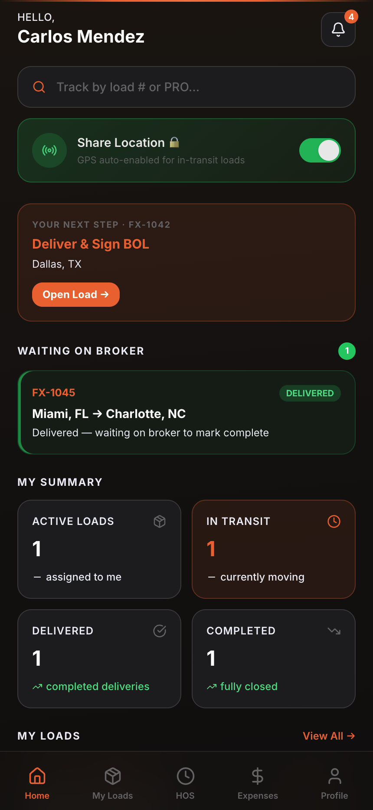
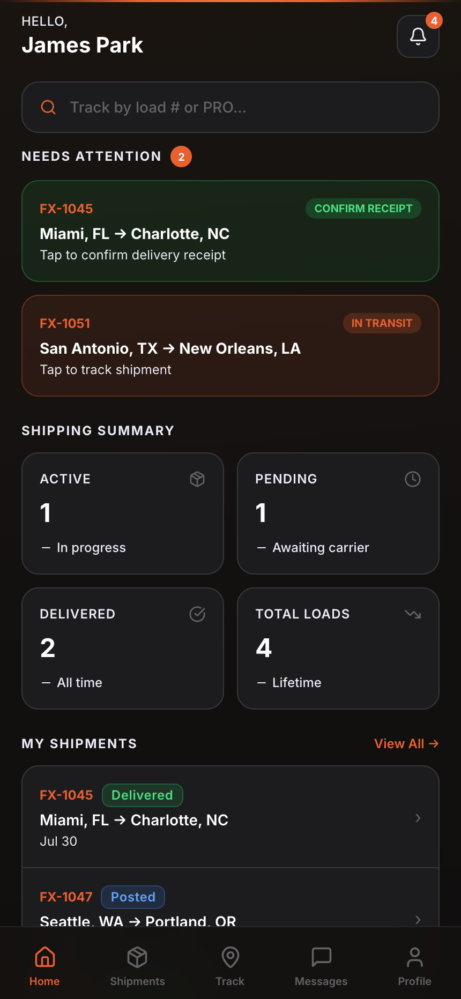

<div align="center">

# FreightX

**A multi-role freight marketplace — carriers, brokers, shippers, and drivers in one platform.**

Built as a commissioned production system for 3 Aces Trucking Inc., a Nashville-based carrier.

[**▶ Live demo**](https://freightx-demo.vercel.app/demo) · [Architecture](#architecture) · [Engineering highlights](#engineering-highlights) · [Run it locally](#run-it-locally)

_Opens straight into a carrier account — no login, no signup. Swap roles at
[/demo/broker](https://freightx-demo.vercel.app/demo/broker) ·
[/demo/driver](https://freightx-demo.vercel.app/demo/driver) ·
[/demo/shipper](https://freightx-demo.vercel.app/demo/shipper)_

</div>

---

## What it is

Freight moves through a chain of parties who all need different views of the same load. A broker posts it. Carriers bid on it. A dispatcher assigns a driver. The driver runs it and signs the BOL. The shipper watches it arrive. Today that chain is stitched together across DAT, phone calls, text messages, and email attachments.

FreightX puts the whole chain in one application, with each role getting a purpose-built interface over shared real-time state.

|             | What they do here                                                                    |
| ----------- | ------------------------------------------------------------------------------------ |
| **Broker**  | Post loads, review incoming bids, counter, award, issue rate confirmations           |
| **Carrier** | Search the load board, bid and negotiate, dispatch drivers, manage fleet and payments |
| **Driver**  | Run assigned loads, share GPS, log HOS, capture receipts, sign BOLs                   |
| **Shipper** | Post freight, track shipments live, confirm delivery receipt                          |

Brokers and carriers can hold **both** authorities — the app ships a role switcher for hybrid operators, which is how a large share of the industry actually works.

---

## Screens

<div align="center">

| Carrier dashboard | Load board |
| :---: | :---: |
|  |  |

| Broker dashboard | Broker load management |
| :---: | :---: |
|  |  |

| Driver | Shipper |
| :---: | :---: |
|  |  |

</div>

---

## Engineering highlights

**Action-first dashboards.** Every role's home screen leads with what that person has to _do_ right now — "2 bids to review", "sign rate con & dispatch", "confirm receipt" — instead of a wall of KPI tiles. The load board groups by pipeline stage (Bidding / Needs Dispatch / Running) rather than by date, because that's the order a dispatcher works in.

**Row-level security as the authorization model.** All 104 migrations run against Postgres with RLS enabled on every table. A broker cannot read another broker's loads, and a driver only sees loads assigned to them — enforced in the database rather than in application code, so it holds regardless of which client is talking to the API.

**Realtime as the default.** The load board, bid threads, notifications, and driver GPS all subscribe to Supabase Realtime channels. When a carrier submits a bid, the broker's dashboard updates without a refresh.

**AI where it removes typing, not as a gimmick.** The load board accepts natural-language queries ("flatbed from Texas to Illinois this week") and parses them into structured filters through a Claude-backed edge function. Rate suggestion runs on a separate model tier.

**Deployed with a real security posture.** Strict CSP with no `unsafe-eval`, HSTS preload, `X-Frame-Options: DENY`, scoped `Permissions-Policy`, and Upstash Redis sliding-window rate limiting at the edge — see [`vercel.json`](vercel.json) and [`middleware.ts`](middleware.ts).

**Documents are legal artifacts.** Rate confirmations and BOLs are generated as PDFs with embedded signature capture, so a signed document is a real record rather than a status flag in a table.

---

## Try it without a backend

The live demo runs entirely client-side. [`/demo`](https://freightx-demo.vercel.app/demo) drops you straight into a fully populated account — no login screen, no signup, no database. Append a role to pick one: `/demo/broker`, `/demo/driver`, `/demo/shipper`. The same roles are also available under **Demo Mode** on the login page.

It works because every service short-circuits on a `demo-` user ID prefix:

```ts
/** Returns true when the app is running in demo mode (no real Supabase calls). */
function isDemoUser(userId?: string): boolean {
  return !!userId?.startsWith('demo-');
}
```

`AuthContext` mints a mock profile and company for the chosen role, the services serve fixtures from [`demo-data.ts`](apps/web/src/lib/demo-data.ts), and the Supabase client falls back to a placeholder URL instead of throwing. The selected role persists in `sessionStorage`, so refreshes and shared deep links keep working for the life of the tab.

> **On the backend:** the Supabase project behind this build has been decommissioned, so live auth and persistence are inactive. The full schema (104 migrations), 17 edge functions, and the service layer are all in this repo — the app is wired to run against a new project by pointing `VITE_SUPABASE_URL` and `VITE_SUPABASE_ANON_KEY` at one.

---

## Architecture

```
freightx/
├── apps/
│   ├── web/                    # React 19 + Vite 6 SPA — the product
│   │   └── src/
│   │       ├── features/       # Feature-scoped components + hooks
│   │       ├── pages/          # 53 routes across 5 role areas
│   │       ├── services/       # Supabase data layer
│   │       ├── contexts/       # Auth, notifications
│   │       ├── shared/         # UI primitives, maps, navigation
│   │       └── lib/            # Client, schemas, demo fixtures
│   └── api/                    # FastAPI service (Dockerized)
├── packages/
│   ├── shared/                 # Cross-app types + constants
│   └── typescript-config/      # Shared tsconfig presets
├── database/migrations/        # 104 ordered SQL migrations, RLS throughout
├── supabase/functions/         # 17 Deno edge functions
├── docs/                       # Feature catalog, architecture, 22 phase guides
├── scripts/                    # health-check, deploy, seed, audit, load-test
├── test/test-features/         # 365 Vitest tests, organized by phase
├── middleware.ts               # Edge rate limiting
└── vercel.json                 # CSP + security headers
```

### Stack

| Layer        | Choice                                            | Why                                                            |
| ------------ | ------------------------------------------------- | -------------------------------------------------------------- |
| UI           | React 19 + Vite 6, TypeScript strict              | SPA; fast HMR, no SSR requirement for an authenticated tool     |
| Styling      | Tailwind v3, custom `fx-*` token namespace        | iOS-inspired dark theme, not a component-library default        |
| Server state | TanStack Query v5                                 | Cache and invalidation without hand-rolled loading state        |
| Data         | Supabase (Postgres, Auth, Storage, Realtime)      | RLS as the authorization layer                                  |
| Maps         | Leaflet + react-leaflet, Mapbox GL                | Live tracking, fleet view, lane heatmaps                        |
| Payments     | Stripe Checkout + invoicing                       | Subscriptions and settlement                                    |
| AI           | Claude (Haiku for parsing, Sonnet for rate suggestion) | Natural-language load search                               |
| Documents    | jsPDF + pdf-lib                                   | Rate confirmations, signed BOLs                                 |
| Infra        | Vercel, Turborepo, pnpm, GitHub Actions           | Monorepo builds, auto-deploy on merge                           |

### By the numbers

|                     |     |
| ------------------- | --- |
| TypeScript files    | 265 |
| Application routes  | 53  |
| SQL migrations      | 104 |
| Edge functions      | 17  |
| Tests passing       | 365 |
| Development phases  | 22  |

---

## Run it locally

```bash
git clone https://github.com/erisdothard/freightx-demo.git
cd freightx-demo
pnpm install
pnpm dev:web          # → http://localhost:5173
```

No environment variables are needed to explore — open `/login` and choose a **Demo Mode** role.

To run against a real backend, copy `.env.example` to `apps/web/.env.local`, fill in a Supabase project's URL and anon key, then apply `database/migrations/` in order.

```bash
pnpm typecheck        # tsc --noEmit across the workspace
pnpm test             # 365 Vitest tests
pnpm build            # Turborepo production build
pnpm lint             # ESLint
```

**Requires** Node 20 and pnpm 10.

---

## Documentation

| Document                                                                            | Contents                                              |
| ----------------------------------------------------------------------------------- | ----------------------------------------------------- |
| [`docs/FEATURE_CATALOG.md`](docs/FEATURE_CATALOG.md)                                 | Every feature across 21 domains, with build status    |
| [`docs/IMPLEMENTATION_STATUS.md`](docs/IMPLEMENTATION_STATUS.md)                     | Source-audited record of what is actually built       |
| [`docs/ENTERPRISE_GPS_ARCHITECTURE.md`](docs/ENTERPRISE_GPS_ARCHITECTURE.md)         | Location pipeline design                              |
| [`docs/COMPETITIVE_ANALYSIS_AND_ROADMAP.md`](docs/COMPETITIVE_ANALYSIS_AND_ROADMAP.md) | DAT/Truckstop gap analysis                          |
| [`docs/phases/`](docs/phases/)                                                       | All 22 phase guides, in order                         |

---

<div align="center">

Built by **[Eris Dothard](https://github.com/erisdothard)** · Nashville, TN

</div>
